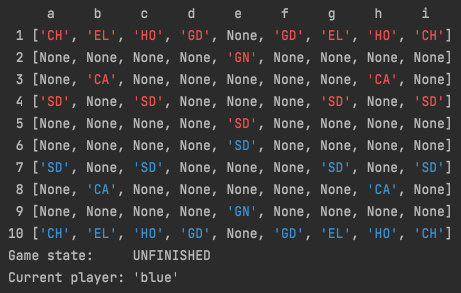
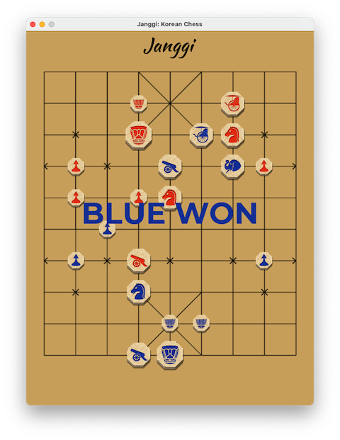

# Janggi

---

Janggi is a Korean strategy board game similar to chess. For more information check out the Wikipedia page [here](https://en.wikipedia.org/wiki/Janggi). Janggi is played with different pieces than western chess but with similar piece movement and a similar goal--to put the opponent's General in check. The board is a 9 x 10 grid with a special 'palace' area to which the General and Guards are restricted. If you know how to play chess you may quickly pick up Janggi!

## Usage

### JanggiGame.py

JanggiGame.py is the backend driver for the game. It handles all the game interaction including the game board, players, and pieces.

Playing the game directly through JanggiGame.py and the terminal is straightforward--the user declares a JanggiGame object and then uses the make_move() method to move their pieces--alternating between the Blue player and the Red player. Moves are passed to make_move() as a source square and a destination square, specified as a string in 'algebraic' notation (i.e. move piece from 'e7' to 'e6'). make_move() returns False if the move is not valid otherwise returns True and records the move. Gameplay continues until one player cannot make any more moves. For example:

```python
game = JanggiGame()
game.make_move('e7', 'e6')  # blue player moves
game.make_move('e4', 'e5')  # red player moves
game.print_board()
print("Game state:    ", game.get_game_state())
print("Current player:", game.get_current_player())
```


### PyGame

janggi_pygame.py uses PyGame to create a GUI for the game.

Simply click on the piece you wish to move (which will then be highlighted) and then click on the destination square. If a move is not legal, the selection will be cleared, and you can start again.


Game over:


